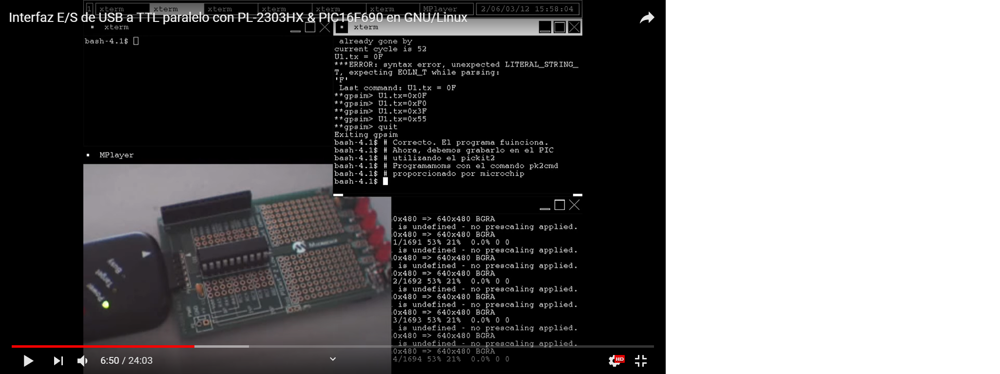

# Product Name
> A simple Serial-In-Parallel-Out / Parallel-In-Serial-Out USB to 5V TTL interface for Microchip's PIC16F690 Micro-controller.

You can watch the [YouTube video](https://www.youtube.com/watch?v=46WZUcRUPEI) of this project for a full demonstrarion of this project.

[](https://www.youtube.com/watch?v=46WZUcRUPEI)

This repository contains the code you'll need to load to your PIC microcontroller in order to send bytes from your POSIX terminal into the outside world as 5V TTL signals.

You can then use these 5V terminals to control real-life devices such as relays or other 5V digital circuitry.

I made this project bakc in college and my purpose was to replace as much of the closed-source software we used from Microchip as I could with Open Source alternatives.

## Installation

To work on this project you're going to need to install the following:

```sh
apt-get install build-essential gputils gpsim
make
```

## Usage example

Check out the YouTube video for a full usage example.

Use the following command to run a gpsim simulation:

```sh
make sim
```
Use these commands to program, start, stop or erase the PIC16F690 respectively:

```sh
make sim
make prog
make start
make stop
make erase
```

## Contact info

**Oscar Mier**
- Github: [@voscarmv](https://github.com/voscarmv)
- Twitter: [@voscarmv](https://twitter.com/voscarmv)
- Linkedin: [Oscar Mier](https://www.linkedin.com/in/oscar-mier-072984196/) 

## 🤝 Contributing

Contributions, issues and feature requests are welcome!

Feel free to check the [issues page](./issues/).

## Show your support

Give a ⭐️ if you like this project!

## Acknowledgments
